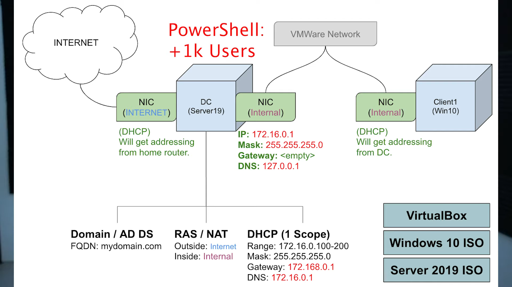

<h1>Active Directory Homelab</h1>


<h2>Description</h2>
In this project I built a basic home lab on my computer utilizing VirtualBox. I set up a main server as a Domain Controller running Windows Server 2019 and a client machine running Windows 10. I connected both systems and configured core services Active Directory for user and account management and DHCP for automatic network configuration. This lab simulates a real-world office network environment and helps me understand how computers and users connect and interact.

<br />

<h2>Environments Languages and Utilities Used</h2>

- <b>Windows 10 ISO</b>
- <b>Windows Server 2019 ISO</b>
- <b>VirtualBox</b>
- <b>PowerShell</b> 

<h2>Domain Controller AD</h2>

 - <b> Domain Controller (AD) connects to both outside and virtual box private network</b>
 - <b> Internal network was assigned IP addresses </b>
 - <b> Routing/NAT utilized for clients on private network can reach the internet through domain controller</b>
 - <b> DHCP created on Domain controller to automatically assign IP addresses to Win10 (clients)</b>
 - <b> Import Powershell to create "clients" </b>

<h2>Windows 10 VM client test</h2>

- <b>Windows 10 installation</b>
- <b>Connected to the private Virtual box network "NIC Internal"</b>
- <b>Named client 1 and used random client to login with domain account</b>


<h2>Program Overview:</h2>

<p align="center">
Overview: <br/>

<br />


<!--<br />
<br/>

<br />
<br />
<br/>

<br />
<br />
<br/>

<br />
<br />
<br/>

<br />
<br />

 
</p>

<!--
 ```diff
- text in red
+ text in green
! text in orange
# text in gray
@@ text in purple (and bold)@@
```
--!>
